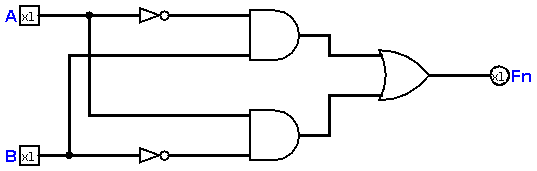
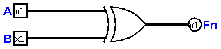
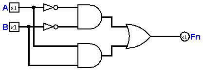
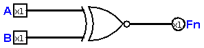

# Chapter 6 : Combinational Circuits

In the previous chapter, we saw how we can make logic gates. Of course, the easy way! 
In this chapter, we're going to make circuits which are famous as *Combinational*. Because we pick some 
well-known gates, and make a circuit out of them.

## The Exclusive OR 
Do you remember XOR from [chapter four](chapter4.md)? The logical function of XOR was like this: 

```
~AB + A~B 
``` 
As you see, we need two NOT gates, two AND gates and one OR gate! Ok, let's make the circuit :



We also have a gate for XOR, because it's very common in circuits, and in transistor level, it's implemented much simpler. 
This is the XOR gate : 



This was the simplest combinational circuit we could ever make. Let's make another one!

## The Exclusive NOR 
This is another combinational circuit we make in this chapter, the function is almost the same as XOR, but it has a little difference. 

```
~A~B + AB 
```

And now, we can make the circuit :



We also have a gate for this function. The gate looks like this :



## More Logics? 
Of course yes! We will make another useful logics in the next chapters. We all studied these six chapters for design and implementation of more logics. 