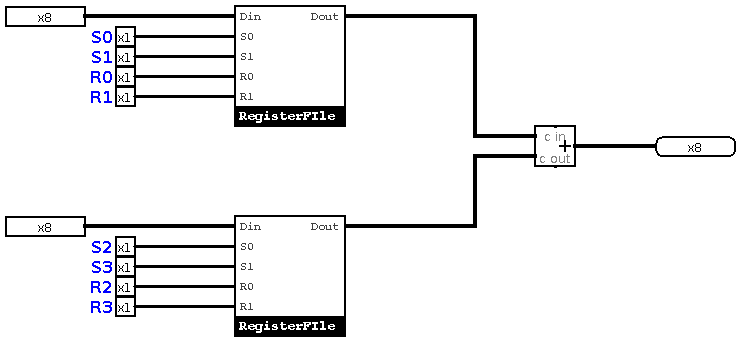
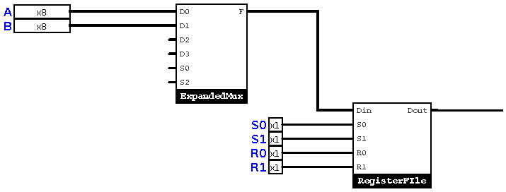
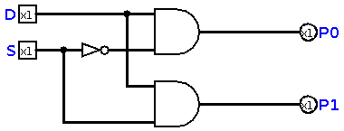
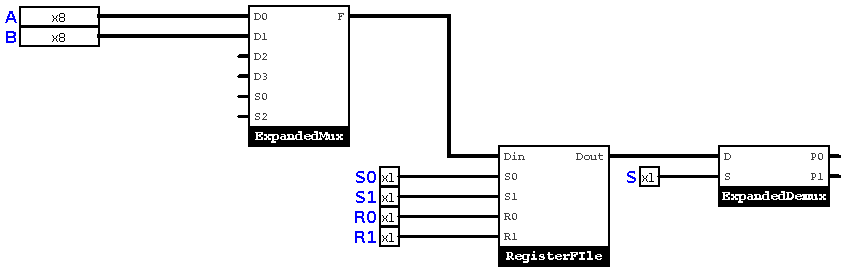
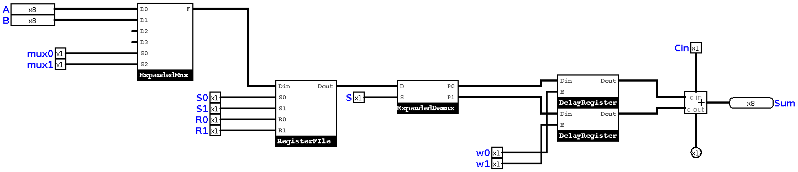

# Chapter 11 : Design, Advanced Addition Machine! 

In [chapter seven](chapter7.md) we designed the must simple (and almost useless) computer, *The Addition Machine*. Now, 
we need to have a background of design and implementation of complex machines, so we add some useful features to our addition 
machine. Our machine had no memory blocks and we couldn't save our inputs and outputs. In this chapter, we will learn how to 
add memory blocks to our addition machine.

## Managing inputs 
Remember our [Register File](chapter9.md)? For now, I want to store my inputs in a register, and then, read from those registers. 
If you look at your simple (or scientific) calculator, you will see a button labled *M* or *M+*. That button is used for inserting 
the inputs or results in calculator's memory. So, I want to make a memory button for our ***Addition Machine***. Our circuit will be 
like this :

This is a good design now, but no! We can make it better, but that's enough for an ***Advanced Addition Machine***. 

## A new device?
As we want only *one* register file, we need a multiplexer in the input. It looks like this : 

So, for new system, we only waste four bits for control. But, we need a device which can help us define the path of our 
data! A device which can be used for unicast (only one direction), multi-cast (more than one direction) and broadcast (sending data to all directions)!. 

### Demultiplexer

A Demultiplexer acts like a backward multiplexer. With a multiplexer, you choose one of data lines, but with a demultiplexer, you 
can send a single data line to a certain destination. The simplest one you can make, is a combination of NOTs and ANDs, like this :

The input line, is connected to input of all ANDs, and *S*, which is our selector, connected with a NOT to first AND, and without NOT to 
second one. This means, with applying changes in selector(s) we can send our data to different lines! Let's add some deumx's to our 
***Advanced Addition Machine***. 

## Selection!

Now, we need to add an 8 bit demux to our Addition Machine. The input lines will look like this : 

Now, we can select A or B inputs of the Adder! Let's add our adder : 

This doesn't *add* anything, because we only switch our inputs? what's our final solution? 

## Temporary Registers 

As you may find, there's no addition in our ***Advanced Addition Machine***. So, we can add two registers to our addition machine, and those are called 
***Temprorary Registers***. Our machine, with temprorary registers will look like this : 

## Let's go!

Now, we designed a simple computer which can work, and it can help us make bigger machines or devices. But, in next chapter, we 
start our design of a real micro-processor. The future chapters, help you understand architecture and organization of the computers 
which we use everyday. 