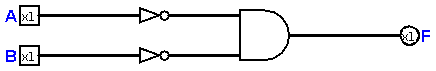
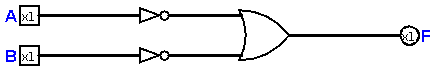

# Chapter 12 : The Computer (Theory)

As we learned some theory and definitions in [chapter ten](chapter10.md), in this chapter we're going to continue 
our ***Theory of Design***. A computer without a strong theory behind it, is like a car without engine! This is the 
saddest truth about computer engineering! If you can't present a good documentation of you design or build, you'll fail! 
To avoid fails, we learn how to design a computer (theory phase) in this chapter!

## The Instruction Set

Every computer, has an ***Instruction Set***. The way instrucions are implemented, is called ***Instruction Set Architecture*** or 
in short, ***ISA***. We need to design one for our dear computer, of course! A computer without ISA, is really impossible! There are a few
tips we should follow in our design of ISA :

* As we want to design a RISC computer, we need to simplify every instrucion we need. For example, a NOR gate can be designed 
with an AND gate with inverted inputs, So we don't need to use both NOR and AND gates! 
* We should document every step of our design, because it's our ***Computer Organization***. And in final product, that's important to 
be mentioned! 
* The last tip is that we need to model everything we designed, later, we learn more about modeling. 

### What Instructions we need? 

As a *real* computer, we need a computer which can handle at least one **logical** and one **arithmetic** Instruction. So, We can make a computer with these instructions :
* AND 
* OR 
* NAND 
* NOR 
* ADD (Addition)
* SUB (Substract)

So, we need to design a unit which can handle *Arithmetic and Logical* instructions. we call this unit ***Arithmetic and Logical Unit*** or ***ALU***. 

## Computer Organization 

This is the most difficult part, In this part you will learn how to think like an engineer! We know, Addition and Subtraction commands are 
implemented by XOR and AND and NOT gates. But, what about NAND and NOR? We can implement NOR using an AND gate like this : 

Also, we can implement NAND, using an OR gate like this : 

## Memory Unit 

I think, using a ***Read Only Memory*** or ***ROM*** is a good idea. But it's actually not! Because it can be programmed easily. So, we need another memory 
block, which is known as ***Random Access Memory*** or ***RAM***. In this book, I never detail how to make a RAM or ROM, it makes this book too hard to understand 
for people who have no idea about RAM or ROM. So, we know what kind of memory we have. 

## Starting Implementation 
In this chapter, we took a look on the theory side of designing a computer. But, as engineers, we need to join the darker side, and start implement 
what we need. In the next chapter, We'll start design of our ALU, then start to connect other things we need to it, it'll be our awesome computer!

