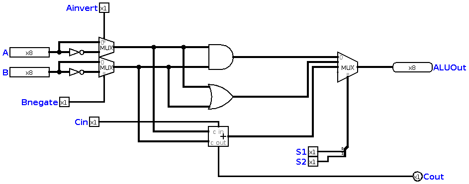
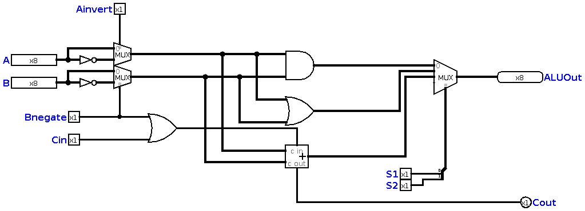
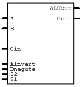

# Chapter 13 : Arithmetic and Logical Unit

This is the start point! In this chapter, we build the main part of our computer, and we will be able to use it in a logical simulator. 
In old days, when computers were weak and expensive, ***ALU*** was an independent part, and it was not integrated with CPU. For example, 
a lot of computers used 74181 IC as the ALU (e.g VAX). Today, ALU, Register file, RAM, etc. Are all integrated in one chip and it's called 
a ***Microcontroller***. But, to understand computer better, we start a modular design, then we put all together, and we'll have a complete 
microcontroller. 

## Tools we need

The main tool you need is a computer, and this is the funny part that *we use a computer to design another computer*. But, you need one, because
we don't want to make a computer in real life, we only want to simulate it. 
It doesn't matter which operating system your computer runs, Windows, OS X, Linux, etc. You need to install Java on your computer, and you know Java 
is freely available. 
Then, you need the most useful tool, [Logisim Evolution](https://github.com/reds-heig/logisim-evolution), a good logical simulation software, 
which is free to use, distribute and advertise. All the schematics we designed in this book, are designed by this software. 

## A note on schematics 
In the book, we built a lot of devices ourselves. But, ***Logisim*** is pre-packaged with good and useful devices such as 
Registers, Flip-Flops, Decoders, Multiplexers, etc. So, In this chapter and next chapters, we are going to use pre-made devices. 

## Start Point
In [chapter twelve](chapter12), we decided about our instructions. I want to assign a code to each instruction, and that's called 
***Instruction Code*** or ***Operation Code***. We will have table like this at the end: 

|Code  |Instruction|
|:-----------------------------------------:|:------------------------------------:|
|   We put a hexadecimal/binary code here   |We put the instruction here           |

But, we don't have any instructions right now, let's implement AND, our very first instruction : 

Then, we need to add OR, but wait! Two outputs for one ALU? Is it possible? of course not! So, we use something called 
a **Multiplexer**. So, I add a 4:1 mux, which is large enough to cover all we need! Then, I add the OR instruction, and we will 
get something like this : 

Now, our table will be like this : 

|S2   | S1  | Instruction |
|:---:|:---:|:-----------:|
| 0   | 0   | AND         |
| 0   | 1   | OR          |

And our microcontroller's ALU, can run two simple programs! But this is not enough. You know, even the simplest processors classified as 
RISC, such as MIPS, can do more than these two instructions. These are logical instructions, but we need at least one or two arithmetic instructions. 
Lets add the instruction *ADD*. After adding that instruction, we will have this :

| Cin | S2 | S1 | Instruction |
|:---:|:--:|:--:|:-----------:|
| 0   | 0  | 0  | AND         |
| 0   | 0  | 1  | OR          |
| 0   | 1  | 0  | ADD         |

We actually don't need *Cin* in our instruction codes, because we won't use this ALU to do ***signed addition***. But, we will need that 
for subtraction. 

## More instructions? 

As you know, we are going to make a computer which can do AND, OR, NAND, NOR, ADD and SUB. We implemented AND, OR and ADD. But, how can we 
add NAND or NOR? We will a NOT gate, and a 2:1 multiplexer. This is how we can implement these two instructions :

Now we have a table like this :

|Ainvert|Bnegate| S2 | S1 | Instruction |
|:-----:|:-----:|:--:|:--:|:-----------:|
|  0    |  0    | 0  |  0 | AND         |
|  0    |  0    | 0  |  1 | OR          |
|  1    |  1    | 0  |  0 | NOR         |
|  1    |  1    | 0  |  1 | NAND        |
|  0    |  0    | 1  |  0 | ADD         |

Now, our ALU is almost complete, but we still don't have subtraction. Subtraction is a bit complex, there are a lot of different 
ways to do subtraction, but we want a perfect way here. As you may remember from [chapter three](chapter3.md), we just suggested 
***Two's Complement*** system for our dear computer. And you remember how that works! First, we need to invert all of the bits (1's become 0, 0's become 1), 
then we add 1 unit to the inverted number. *Cin* works like a *plus one* button for us, and *Bnegate* inverts *B* for us. If we add an OR gate, 
then we will have subtraction. Like this :

When *Bnegate* is high, automatically *Cin* becomes high on the adder. Now, we can have our ***Instruction Table*** like this : 

|Ainvert|Bnegate| S2 | S1 | Instruction |
|:-----:|:-----:|:--:|:--:|:-----------:|
| 0     | 0     | 0  | 0  | AND         |
| 0     | 0     | 0  | 1  | OR          |
| 1     | 1     | 0  | 0  | NOR         |
| 1     | 1     | 0  | 1  | NAND        |
| 0     | 0     | 1  | 0  | ADD         |
| 0     | 1     | 1  | 0  | SUB         |

We implemented the most simple ALU we could, and after some modifications, ALU module will look like this :

I didn't remove *Cin* , because it will be needed when we want to expand our ALU (in following chapters, we will talk about expanding ALU)

## Next Step 
In these 13 chapters, we learned logic and design, and we've designed a simple ALU. But, ALU is not everything a computer needs. We need a simple 
memory block, which can control programs, etc. So, In next chapter, we will learn how to define a program structure, and then we can add memory block 
we need. At the end, we can really make our very own programmable microcontroller. 