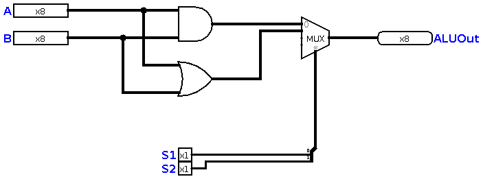

# Chapter 13 : Arithmetic and Logical Unit

This is the start point! In this chapter, we build the main part of our computer, and we will be able to use it in a logical simulator. 
In old days, when computers were weak and expensive, ***ALU*** was an independent part, and it was not integrated with CPU. For example, 
a lot of computers used 74181 IC as the ALU (e.g VAX). Today, ALU, Register file, RAM, etc. Are all integrated in one chip and it's called 
a ***Microcontroller***. But, to understand computer better, we start a modular design, then we put all together, and we'll have a complete 
microcontroller. 

## Tools we need

The main tool you need is a computer, and this is the funny part that *we use a computer to design another computer*. But, you need one, because
we don't want to make a computer in real life, we only want to simulate it. 
It doesn't matter which operating system your computer runs, Windows, OS X, Linux, etc. You need to install Java on your computer, and you know Java 
is freely available. 
Then, you need the most useful tool, [Logisim Evolution](https://github.com/reds-heig/logisim-evolution), a good logical simulation software, 
which is free to use, distribute and advertise. All the schematics we designed in this book, are designed by this software. 

## A note on schematics 
In the book, we built a lot of devices ourselves. But, ***Logisim*** is pre-packaged with good and useful devices such as 
Registers, Flip-Flops, Decoders, Multiplexers, etc. So, In this chapter and next chapters, we are going to use pre-made devices. 

## Start Point
In [chapter twelve](chapter12), we decided about our instructions. I want to assign a code to each instruction, and that's called 
***Instruction Code*** or ***Operation Code***. We will have table like this at the end: 

|Code  |Instruction|
|:----:|:---------:|
|      |           |

But, we don't have any instructions right now, let's implement AND, our very first instruction : 

Then, we need to add OR, but wait! Two outputs for one ALU? Is it possible? of course not! So, we use something called 
a **Multiplexer**. So, I add a 4:1 mux, which is large enough to cover all we need! Then, I add the OR instruction, and we will 
get something like this : 

Now, our table will be like this : 

|S1   | S0  | Instruction |
|:---:|:---:|:-----------:|
| 0   | 0   | AND         |
| 0   | 1   | OR          |

And our microcontroller's ALU, can run two simple programs! 