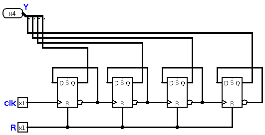
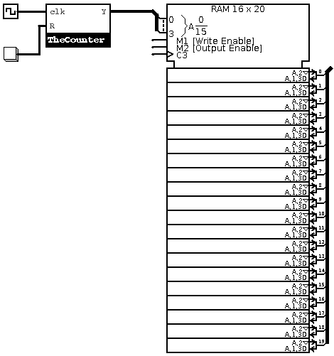
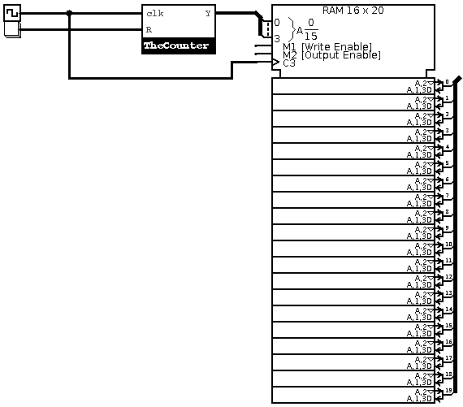
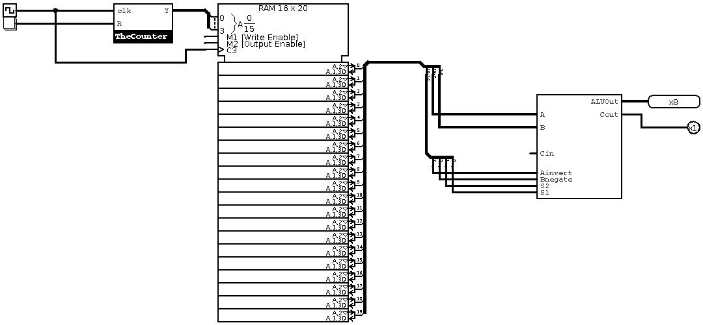

# Chapter 15 : Microcontroller 
In this chapter, we make our dear computer! You've studied previous chapters to learn how to make your very own 
computer! Actually, the most important part was *ALU*. In this chapter, we will design a simple and maybe stupid 
*Control Unit* and we add a *RAM* from logisim standard library. Then, we can program it! Let's know how we can 
do this!

## Control Unit 
This one, is a bit harder to understand. But don't worry. We're just going to make the simplest ones. We will take 
a deeper look on this unit in following chapters (and maybe books!) but for this book, we make a simple one. Let's first
define this unit. Control unit, controls programs loaded in our main memory, and controls what happens in ALU. Actually, 
control unit is made up of a device which is called *counter*. A counter is a register , or a bunch of registers which 
can count! How? the counting process is controlled by *clock pulse*. But why is it important? A counter can store 
address of a program, then its output can be input of the ***Address Bus*** of the RAM. This is the simplest use of 
a counter in a computer. But how can we make a counter? we can connect four D flip flops in this arrengement and make 
our counter : 

It has a common *reset* pin, and a clock input. Also, it has a 4-bit output labled *Y*. This is the simplest binary counter 
we can make. As it has four bits, it will count from 0 to 15 for us. This means we need a RAM block with 4-bit address bus. 
An actual control unit is not that simple, usually it includes some decoders, multiplexers and AND gates to control and activate/deactivate 
computer parts. But for our simple programmable computer, this one is enough!. 

## Memory Unit 
We made a counter, which counts address for us. But, which address? Actually, we need a memory block like a RAM. If we look at RAM simply, 
it's very similar to register file. But, an actual and functional RAM is much more different. Let's add the RAM :

Now, we can store our programs in RAM! But wait, if you look closer at the picture above, you'll find that RAM is not connected 
to the clock. So it won't work. This is what you actually need : 

Now, let's make the microcontroller! 

# Combination of Things!
We made a bunch of devices, connected them together and made new devices, and finally, we made ALU. Let's connect the ALU 
to RAM. Remember this? 

| Instruction Code | Operand A | Operand B |
|:----------------:|:---------:|:---------:|
| 4 bits           | 8 bits    | 8 bits    |

And now, we need a special device which is called *Splitter* to split parts we need. Then, we will need smaller splitters 
to split instruction code to bits. If you remember, we had this table for instruction codes : 

|Ainvert|Bnegate| S2 | S1 | Instruction |
|:-----:|:-----:|:--:|:--:|:-----------:|
| 0     | 0     | 0  | 0  | AND         |
| 0     | 0     | 0  | 1  | OR          |
| 1     | 1     | 0  | 0  | NOR         |
| 1     | 1     | 0  | 1  | NAND        |
| 0     | 0     | 1  | 0  | ADD         |
| 0     | 1     | 1  | 0  | SUB         |

let's connect them together! And now, we have this : 

## What should we learn now? 
After reading these fifteen chapters, you learned how to make your very own computer in gate-level. Now, you can learn programming 
and program your computer and test it, or you can learn digital electronics and make it in transistor-level. In following chapter, 
we will take a quick look at *assembly* language of our microcontroller, and we try to make some programs we need. It will help you 
understand how your real computer works!