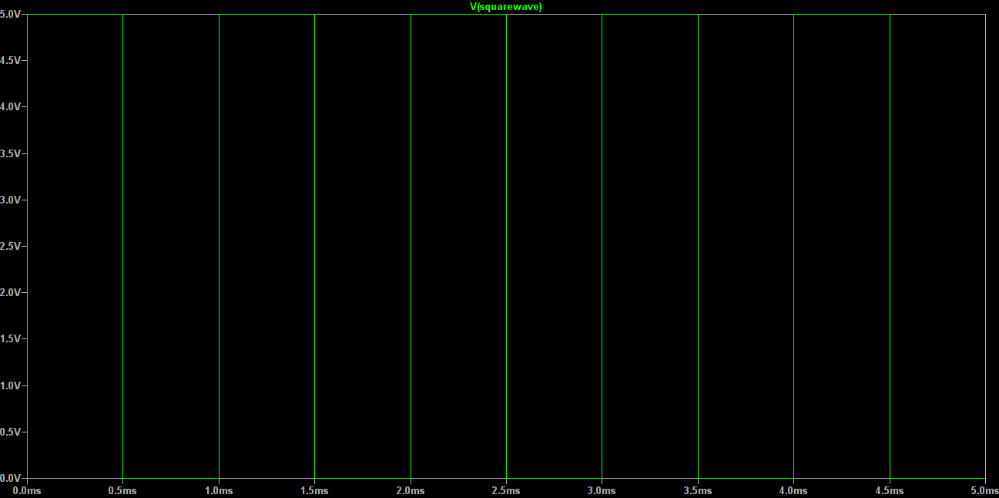
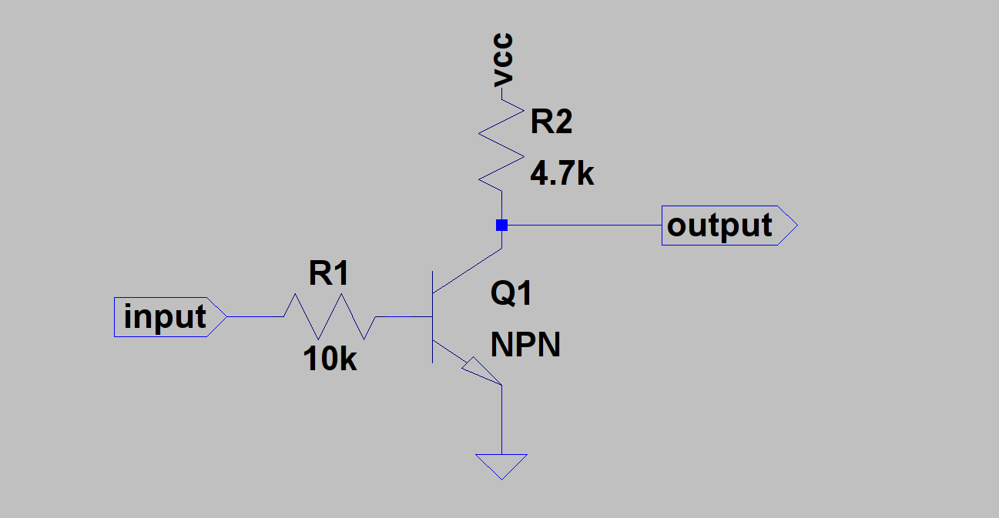
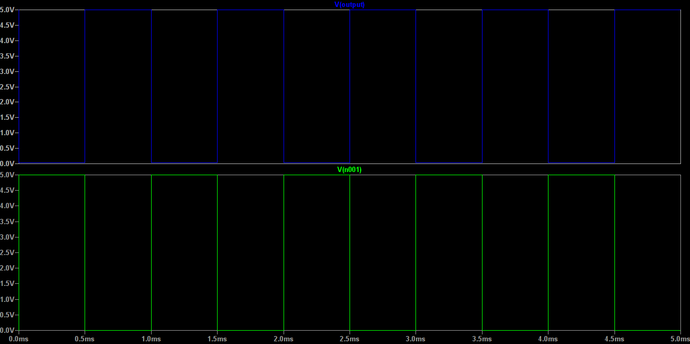
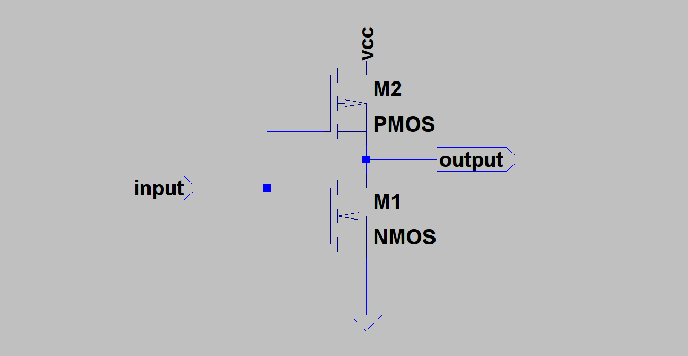
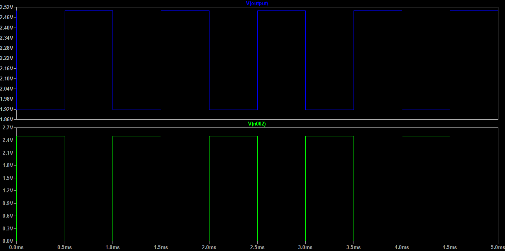

# Chapter 17 : The Dark Side of The Moon
This is not about Pink Floyd's album, this book has nothing to do with music of course. But, I chose this name because 
a lot of *computer engineers* have no idea about design and implementation of the hardware. So, it can be the dark side! 
Some people, including some computer engineers and electrical engineers, joined the dark side and made computers. But this is 
not all! We had computers before transistors. They were usually electro-mechanical or mechanical. But the theory of computation 
is much older than what you think! ***Khawrazmi***, a Persian scientist, is one of the most known people in history of computer 
science. Even the word ***Algorithm*** is taken from his name. In 1947, *Transistor* discovered, and that was the starting point of 
***Electronic Computers***. 

## Digital Electronics
When transistors discovered and manufactured, scientists and engineers found that they can acts like switches. Then, they decided to use 
them as switches. A transistor can act like a switch, but first, look at this square wave: 



It starts at zero volts and ends at five volts. It's like a switch which is connected to a five volts battery, and someone pressed button 
in defined times. This pulse, can be input or output of a transistor. First, let me show you a NOT gate which is made by a ***Bipolar Junction
Transistor*** or in short, **BJT** transistor. BJT transistors are like two diodes connected in a specific arrengement. Usually, we use *NPN* transitors
to make logical circuits:



If we apply a voltage on *input* we will have a ***wave form analysis*** like this : 



As you can see, everytime input is high, output is low, and everytime input is low, output is high. Why? when *input* is high, 
current can move to the ground, but when it's low, current find another way to the ground, which is our output. 

RTL/TTL technologies are good, but later engineers found that ***Field Effect Transistors*** are better. Then, they decide to use 
***Metal Oxyde Semiconductor Field Effect Transistor***s or in short **MOSFET** transistors for their artworks! FETs have different 
structure, but still can act as switch, and even better than BJTs. Also, they can be minimalized better. This is why a lot of digital 
chips around us is made up of MOSFETs. MOSFETS are usually two types, nMOS, or ***Negative Channel*** and pMOS or ***Poisitive Channel***. 
As engineers wanted the best performance, they just used both of them. When you use both nMOS and pMOS transistors, you actually used 
***Complementary Metal Oxyde Semiconductor*** or *CMOS* technology. This is a CMOS inverter (or the same NOT gat):



Let's apply voltage on input, and see what happens! 



As you can see, the result is very similar to TTL/RTL design. When you design a digital circuit, you should consider everything! Waste of power, 
price, noise-resistance and size. For example, TTL is a good design as it's cheap and has good resistance against noise, but it's not as small as 
we want. But CMOS is small enough to be on a chip! Also, there's a method for minimalizing CMOS designs, and implementation of more logics by less
transistors, which is called ***Very Large Scale Integration*** or in short, **VLSI**. I think this is enough, let's take a look on other ways of 
implementing a computer in real life. 

## Integrated Circuits 
Imagine a rectangular black thing, which includes twenty transistors. This is actually an integrated circuit. Integrated circuits 
are made up of tiny transistors, and they easily can be find in electronics stores. They integrated a lot of circuits on a piece of 
semiconductor, connected metal legs to that, and covered with plastic, then you can buy them and use them in your projects. Also, IC's 
classified by their technology. For example, you know 7400 series are TTL IC's, or 28 Series are EEPROM's. Anyway, there is one other way, 
and you may find that the easiest way to join the dark side!

## Program The Hardware 
There are some programming languages, which are called ***Hardware Description Language*** or in short, **HDL**. They're easy to use, 
and they're actually similar to *C* or *Assembly* programming languages. One of my favorite HDL's is *Verilog*. I program an AND gate in 
HDL like this : 

```verilog 
module AND(A, B, F);
 input wire A;
 input wire B;
 output wire F;

 assign F = A & B;

endmodule
```
And for that, we need a ***Complex Programmable Logical Device***, CPLD or a ***Field-Programmable Gate Array***, FPGA. Those devices 
have logical applications, but they have no logics, and we have to program them to make them functional. A lot of ligical simulator programs, 
like *logisim* can generate Verilog or VHDL code of the designed logical circuit. And then, you can upload the code on your FPGA and have your 
very own logical device. And any other way to design and implement a real hardware? Of course there is a lot of other ways. But these ways are 
the easiest ways to do that with a low-budget (not sure of this!) and basic knowledge of computers and electronics. 

## The last part!
This is the last part of the book! I tried to do my best for this one. Actually, this is my first English book, but I'm glad, because I could 
share my knowledge and experiences. This book is written to make understanding a computer easier. First, I started it in Summer (2016) and it finished 
in Spring (2017). About 8 or 9 months spent on this book, and I hope you enjoy!