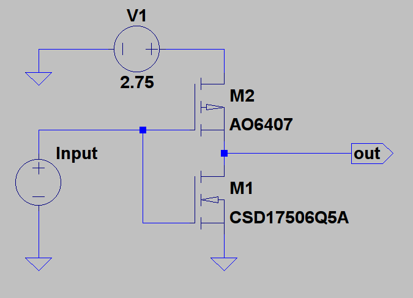
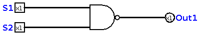
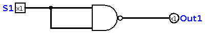
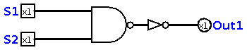
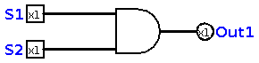

# Chapter 5 : Logical Circuits
Do you remember two logics **NAND** and **NOR** ? These logics are called *Universal Logic*, because
in digital electronics, we make all other logics using these two logics! The smallest part of a logical circuit, is 
called a **gate**. each gate is a specific arrangement of transistors. For example, this is a *NOT gate* using MOSFET 
transistors :

I picked this picture from one of my old projects, and in this book, we won't use any transistor, we just use symbolic schematics
of logic gates to design logical circuits! 

## The NAND 
Although we can make all logics using NOR, I prefer using NAND. This is just my personal opinion, and after reading and understanding 
the previous chapter and this chapter, you can make all of these logics using NOR. This is what I call "The magic of boolean algebra". 
First, we need to know how NAND works! It works like a key with two switches, and when to switches are off, the output will be on! This is the simplest
definition of NAND. When we want to show it on circuit, we use this shape :

A D-shaped thing with a bubble at the end. This is NAND! You know how it works, because you read the [chapter four](chapter4.md) and you learned what are these functions!

### NOT Gate
The NOT gate is another simple and basic gate, you need to know. It's built using a NAND Gate like this: 

Did you see how it works? Yes! We simply connect two inputs of a NAND gate to a switch. The NOT gate in general, is represented like this :

### AND Gate 
As you remember from the previous chapter, we made NAND function by adding a NOT to AND. So, we know `~(~A) = A `. This means we can add a NOT gate in output of NAND, 
and get AND function. Just like this : 

But in reallity, if you remove the bubble from NAND gate, you will have AND : 

