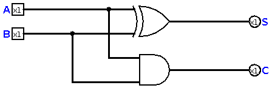
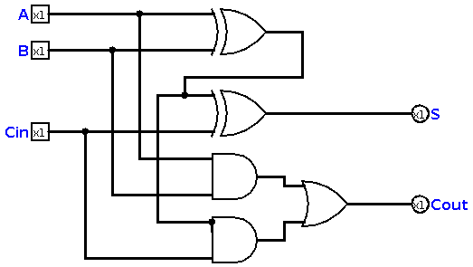
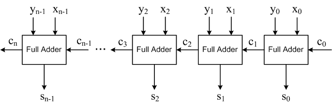

# Chapter 7 : The First Computer

Now, you know logic and arithmetic, two basics of computers. Of course, every device with the ability of solving logical and arithmetic 
problems, is a computer! Humans are computers, calculators are computers, and that expensive (and almost useless) iPhones are computers, too. 
In this chapter, we just make the simplest computer. We need this computer in near future, as a part of other computer. That's interesting, isn't that? 

## The Function
When we decide to design a device, we need to define its function. For example, imagine a mechanical engineer who wants to design an engine, but
he doesn't describe its function! So, no one will buy that engine, because no one knows how it works or how it's made, or what's its function! 
As a good and practical design, I considered **Addition Machine**. It's a simple calculator (or computer) we can design using a few gates. 

### Boolean Algebra!
We learned boolean algebra in [chapter four](chapter4.md) and for now, we just see it in action! For designing an *Addition Machine* , we need this simple function :

```
Sum = ~AB + ~BA 
Carry = AB 
```
Did you find the point? we just need a XOR and an AND gate! 

## The Half Adder 
Imagine this circuit, which is the implementation of the function in previous part : 



The truth table for this circuit will be :

| H.A | A   | B   |  Carry (C) | Sum (S) |
|-----|:---:|:---:|:----------:|:-------:|
|     | 0   | 0   | 0          | 0       |
|     | 0   | 1   | 0          | 1       |
|     | 1   | 0   | 0          | 1       |
|     | 1   | 1   | 1          | 0       |

It makes 0, 1 and 2 for us! It's another interesting thing we can design and implement! but, it's not complete yet! Why? It does not make 3 for us, it has 2 inputs but not 4 outputs! 
So, we still need some improvements on the circuit!

## The Full Adder 
Half adder is good, but it's not everything. Of course, it can't help us make bigger adders, so we need to connect two half adders, and make a new adder wich is called
a **full adder**. A full adder, can actually make all expected outputs for us. This is the full adder :



Truth table of a full adder is like this : 

| F. A | Carry-in   | A   | B   | Carry(Cout) | Sum(S) |
|------|:--------:  |:---:|:---:|:-----------:|:------:|
|      | 0          | 0   | 0   | 0           | 0      |
|      | 0          | 0   | 1   | 0           | 1      |
|      | 0          | 1   | 0   | 0           | 1      |
|      | 0          | 1   | 1   | 1           | 0      |
|      | 1          | 0   | 0   | 0           | 1      |
|      | 1          | 0   | 1   | 1           | 0      |
|      | 1          | 1   | 0   | 1           | 0      |
|      | 1          | 1   | 1   | 1           | 1      |

Now, we have ability of making a big adder! And that big adder will be our dear *Addition Machine*. 

## Ripple-Carry adder     
The full adder we've designed is actually one bit. If we want to design a computer with the word size of one bit, we can consider that 
full adder as a simple computer. Now, as you remember from [chapter two](chapter2.md), we decided to make a microcontroller with word size 
of eight bits! So, I want to make a 8-bit adder. But How?! 

As you can see, each full adder has a carry-in and a carry-out pin, what we need is connecting 8 full adders together, and we need these pins. 
If we put one adder , and connect its carry-out to next one's carry-in, then I'll get a *Ripple-Carry adder*. A ripple-carry adder looks like this :



Not only 8 bits, we can make the adder with a custom word-size, according to the design of ripple-carry adder. Congratulations! You made your first computer! 

## Let's talk about computers!
In this chapter, we just designed and implemented a simple computer known as a *Ripple Carry Adder* or *Addition Machine*. It's a complete computer with a single instruction, but 
of course it's not functional yet. Because we didn't design a memory unit, a simple control unit, etc. In next chapter, we will add some memory blocks to this computer and then, we start
designing a complete and **functional** computer.