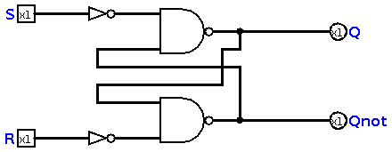
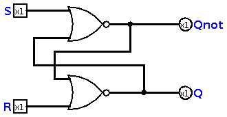
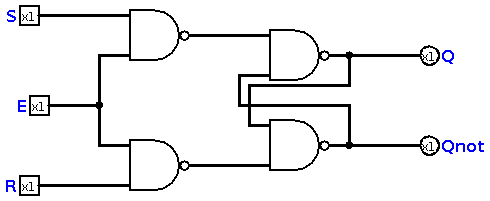
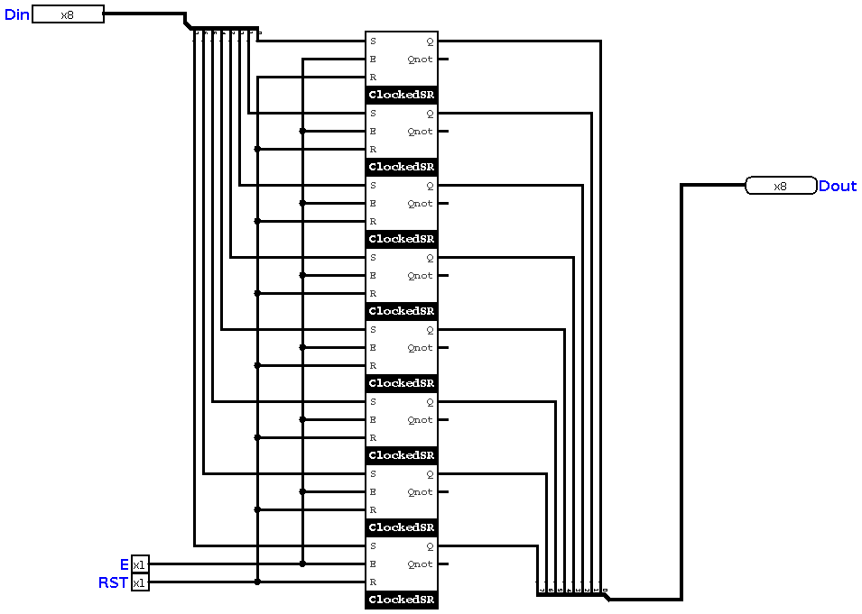

# Chapter 8 : Memory

Although our *Addition Machine* was a complete computer, but actually, a computer without memory is like a car without seats. You know a car can be driven 
without seats, but we add seats, because seats can keep passengers! And this is the point! We want a certain space for keeping data. According to the 
[chapter six](chapter6.md), we know that a *combinational circuit* is a circuit which can solve a logic/arithmetic problem without storing the results. 
In this chapter, we are going to study a new family of circuits, which are called **Sequential Circuits**. 

## Everything is NAND! 
You need NAND, even here. Of course, we need to know how NAND works and how can make memory blocks only using NAND. The simplest memory block is this :

This is called an **active-low S-R flip flop**. If we replace NAND gates with NOR, we will have an **active-high S-R flip flop**. So, as all of the circuits of this book are 
active-high, let's see active-high version of our flip flop :

As you can see, `Q` and `~Q` are replaced in the new circuit. It doesn't matter what kind of flip flop you use, but I actually prefer the active-high one. 

## Basic Improvement

Consider that lovely NAND based implementation of SR, and if we modify that like this : 

I added two gates, and one pin. The new pin is called **enable**. It enables the circuit, that means I actually need to turn it on for applying
all changes in the input! The new circuit is called  *SR flip-flop with enable*. Later, we will call that **Clocked SR**. 

## Register
We can consider this flip flop as *one bit memory block* or *one bit register*. But, as we decided in [chapter two](chapter2.md), we want 8 bits registers. 
So, we need to connect eight memory blocks together! How is it possible? We just need to pick eight of them, then connect a common enable and reset button to them. 
And the input (S pins) will be parallel. The schematics of a register, is like this :

This is the simplest register we can make, but we need a better design for our flip flops to prevent noises and oscillations! So, we don't use this kind of register in our 
computer!