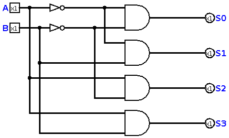
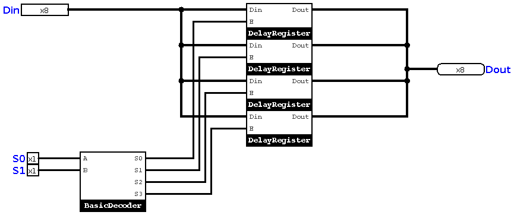
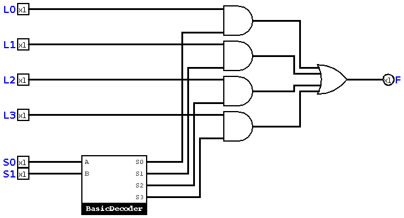
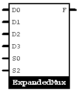

# Chapter 9 : Register File

In previous chapter, we made 1 bit flip flops, and connected them together, then we had registers. Registers are needed, 
but we can't say "We are great computer engineers because we have registers!". Registers have special organization in a computer,
and that's called ___Register File___. In this chapter, we will design a simple one!

## The Decoder
Let's make another combinational circuit here. The circuit we are making here, is called ***Decoder*** . 
Decoders have *n* selectors, and `2^n` outputs. This is why they're decoders! You give them a binary number as
input and you take a hexadecimal number in the output. Of course, you never get the *exact* hex number at the output, 
but you can find hexadecimal notation of input by using a decoder. Let's make one! The simplest decoder we make is a 
2x4 decoder. According to `2^n`, we can also make 1x2 decoder, but it's not actually a real decored. It's an AND gate! 
The logical function of a 2x4 decoder is like this : 
```
S0 = ~A~B  
S1 = ~AB 
S2 = A~B 
S3 = AB 
``` 
So, we can implement our decoder like this : 



But, how we use this in a *Register File* ? 

## Simple Register File 
We have a 2x4 decoder. So, for now we can make a simple register file with four registers. The outputs of decoder, 
will be connected to *Enabler* pin of registers. Just like this : 



This is actually not a good design, it can generate a lot of noises, so we need another device, which allows us to select 
one of outputs! 

## The Multiplexer 
You know, we need a device which acts like a decoder, but it does a selection among input data lines. This device is called 
a *Multiplexer*. In this book, We call it **Mux**. A mux can be implemented using a decoder, and a bunch of AND/OR gates. Like this :
This is a simple mux : 



For our register file, we need a mux which can handle 8 bits input and output. So, I connect 8 muxes together, and I'll have 
a big mux like this : 

 

Now, we can go back and complete our register file. 